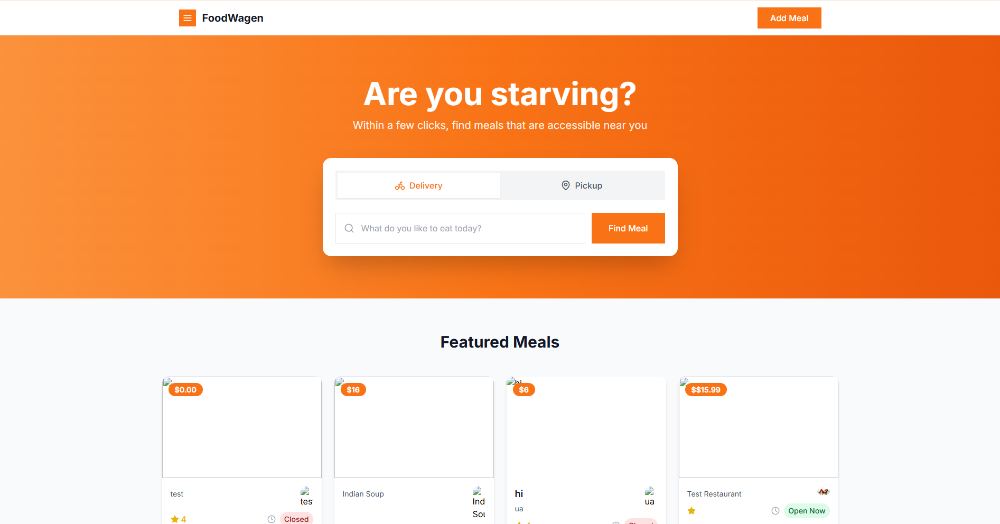
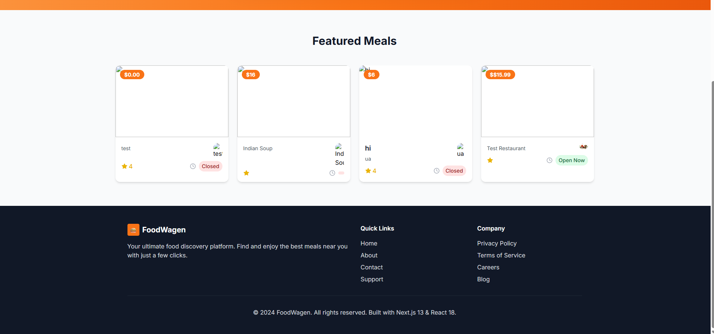
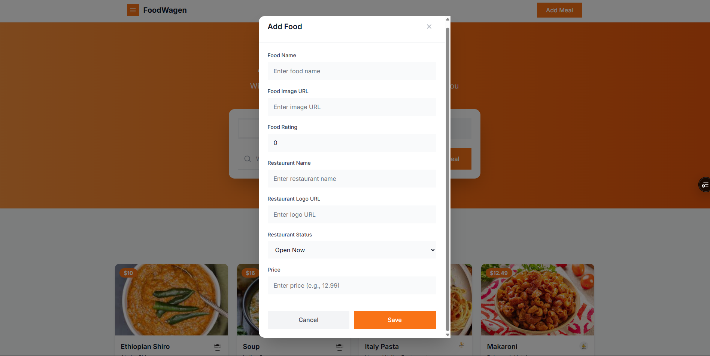
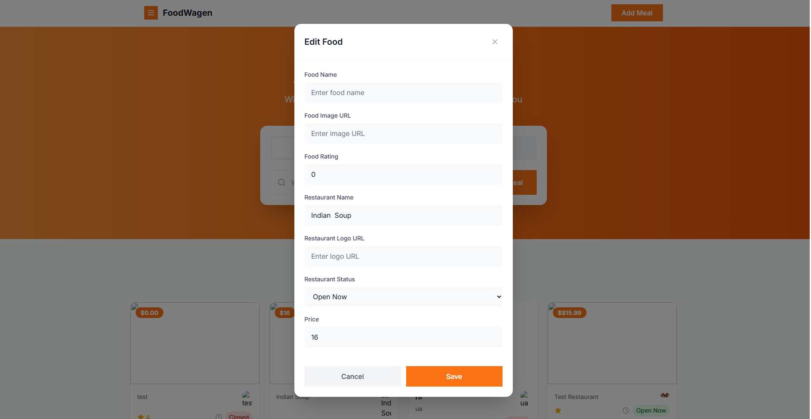
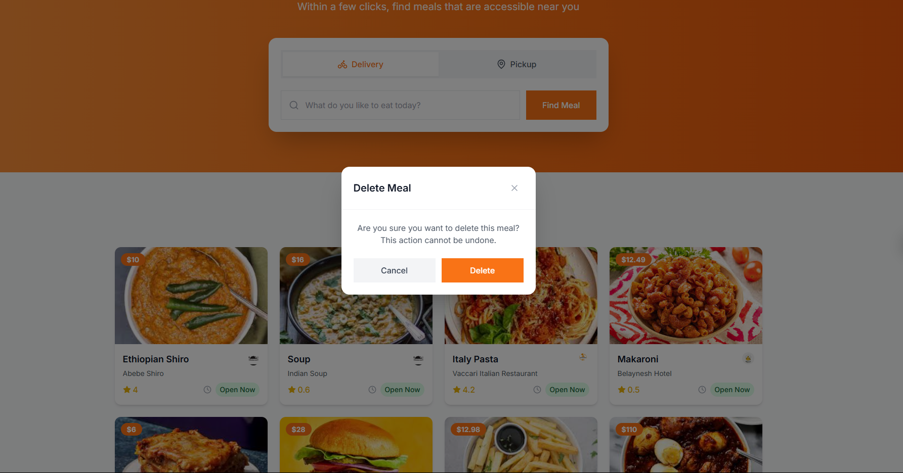

# 🍔 FoodWagen - Food Management System

A modern food management web application built with **Next.js 13**, **React 18**, and **Tailwind CSS** for the Eskalate.io technical assessment.

## 🚀 Live Demo

- **🌐 Live Application**:  https://vercel.com/abebes-projects-6e007fbe/eskalate-food-management
- **📱 Responsive Design**: Works perfectly on desktop, tablet, and mobile devices

## 📸 Application Screenshots

### 🏠 Main Dashboard

*Clean, modern interface with featured meals and search functionality*

### 📱 Responsive Layout

*Fully responsive design that works seamlessly across all devices*

### ➕ Add New Meal

*Intuitive form with validation for adding new food items*

### ✏️ Edit Meal Details

*Easy-to-use editing interface with pre-populated data*

### 🗑️ Delete Confirmation

*Safe deletion with confirmation dialog to prevent accidental removals*

## ✨ Features

### 🎯 Core Functionality
- ✅ **CRUD Operations**: Create, Read, Update, Delete food items
- ✅ **Search & Filter**: Real-time search functionality
- ✅ **Responsive Design**: Mobile-first approach with Tailwind CSS
- ✅ **Form Validation**: Client-side validation with error handling
- ✅ **API Integration**: Connected to MockAPI for data persistence
- ✅ **Loading States**: Smooth loading indicators and transitions

### 🎨 User Experience
- 🎨 **Modern UI/UX**: Clean, intuitive interface design
- 🔄 **Real-time Updates**: Instant feedback on all operations
- 📱 **Mobile Optimized**: Touch-friendly interface for mobile devices
- ⚡ **Fast Performance**: Optimized with Next.js 13 App Router
- 🎭 **Interactive Elements**: Hover effects and smooth animations
- 🖼️ **Image Support**: Dynamic image loading with fallback placeholders

## 🛠️ Tech Stack

### Frontend Technologies
- **Next.js 13** - React framework with App Router
- **React 18** - Latest React with Server Components
- **TypeScript** - Type-safe development
- **Tailwind CSS** - Utility-first CSS framework
- **Lucide React** - Beautiful SVG icons

### Backend & Data Management
- **MockAPI** - RESTful API for data persistence
- **Fetch API** - Modern HTTP client for API calls
- **Form Validation** - Custom validation logic
- **Image Optimization** - Next.js Image component

### Development & Build Tools
- **ESLint** - Code linting and formatting
- **PostCSS** - CSS processing and optimization
- **Autoprefixer** - CSS vendor prefixing
- **Git** - Version control system

## 📁 Project Architecture

\`\`\`
foodwagen-app/
├── 📁 app/
│   ├── 🎨 globals.css          # Global styles and Tailwind config
│   ├── 🏗️ layout.tsx           # Root layout component
│   ├── 🏠 page.tsx             # Main page component
│   └── ⏳ loading.tsx          # Loading component
├── 📁 components/
│   ├── 📁 ui/                  # Reusable UI components
│   │   ├── 🔘 button.tsx
│   │   ├── 🃏 card.tsx
│   │   ├── 📝 input.tsx
│   │   ├── 📊 progress.tsx
│   │   └── 🏷️ badge.tsx
│   ├── 🧭 Header.tsx           # Navigation header
│   ├── 🎯 HeroSection.tsx      # Hero section with search
│   ├── 🍽️ FeaturedMeals.tsx    # Meals grid display
│   ├── 🍔 MealCard.tsx         # Individual meal card
│   ├── ➕ MealModal.tsx        # Add/Edit meal modal
│   ├── 🗑️ DeleteModal.tsx      # Delete confirmation modal
│   └── 🦶 Footer.tsx           # Footer component
├── 📁 lib/
│   ├── 🔌 api.ts               # API integration layer
│   ├── ✅ validation.ts        # Form validation logic
│   └── 🛠️ utils.ts             # Utility functions
├── 📁 types/
│   └── 🍕 food.ts              # TypeScript type definitions
├── 📁 screenshots/             # Application screenshots
│   ├── 📸 Dashboard1.png
│   ├── 📸 Dashboard2.png
│   ├── 📸 add_meal.png
│   ├── 📸 edit_meal.png
│   └── 📸 delete_meal.png
├── 📁 public/                  # Static assets for the app
├── ⚙️ tailwind.config.ts       # Tailwind CSS configuration
├── ⚙️ next.config.js           # Next.js configuration
└── 📦 package.json             # Dependencies and scripts
\`\`\`

## 🚀 Getting Started

### Prerequisites
- **Node.js** 18.0 or higher
- **npm** 8.0 or higher (or **yarn** 1.22+)
- **Git** for version control

### 🔧 Installation Steps

1. **📥 Clone the repository**
   \`\`\`bash
   git clone https://github.com/YOUR_USERNAME/eskalate-food-management.git
   cd eskalate-food-management
   \`\`\`

2. **📦 Install dependencies**
   \`\`\`bash
   npm install
   \`\`\`

3. **🚀 Start development server**
   \`\`\`bash
   npm run dev
   \`\`\`

4. **🌐 Open your browser**
   Navigate to [http://localhost:3000](http://localhost:3000)

### 🏗️ Build for Production

\`\`\`bash
# Build the application
npm run build

# Start production server
npm start
\`\`\`

## 🎯 Feature Demonstrations

### 1. 🍽️ **Food Management System**

- **Add** new food items with complete details (name, rating, price, restaurant info)
- **Edit** existing food information with pre-populated forms
- **Delete** food items with safe confirmation dialogs
- **View** all foods in a beautiful, responsive grid layout

### 2. 🔍 **Advanced Search Functionality**
- **Real-time search** as you type in the search bar
- **Filter by food name** or restaurant name
- **Instant results** with smooth loading states
- **Clear search** functionality to reset filters

### 3. 📱 **Responsive Design Excellence**

- **Desktop**: Multi-column grid layout (4 columns on large screens)
- **Tablet**: Optimized 2-3 column layout for medium screens
- **Mobile**: Single-column stack layout with touch-friendly interactions
- **Adaptive UI**: Components resize and reflow naturally

### 4. ✅ **Smart Form Validation**

- **Required field validation** with clear error messages
- **URL format validation** for food images and restaurant logos
- **Rating range validation** (0-5 stars)
- **Real-time feedback** as users type
- **Price format validation** for monetary values

## 🔧 API Integration Details

The application seamlessly integrates with MockAPI for full data persistence:

**Base URL**: `https://6852821e0594059b23cdd834.mockapi.io`

### 📡 Available Endpoints:
- **GET** `/Food` - Fetch all food items
- **POST** `/Food` - Create new food item
- **PUT** `/Food/:id` - Update existing food item
- **DELETE** `/Food/:id` - Delete food item
- **GET** `/Food?name=query` - Search food items by name

### 🔄 API Features:
- **Error handling** with user-friendly messages
- **Loading states** during API calls
- **Optimistic updates** for better UX
- **Retry logic** for failed requests

## 🎨 Design System & UI Components

### 🎨 Color Palette
- **Primary Orange**: #FF9500 - Brand color for CTAs and highlights
- **Secondary Gray**: Various shades for text and backgrounds
- **Success Green**: #10B981 - For positive actions and status
- **Error Red**: #EF4444 - For warnings and error states
- **Warning Yellow**: #F59E0B - For caution and pending states

### 📝 Typography System
- **Font Family**: Inter (Google Fonts) - Modern, readable typeface
- **Headings**: Bold weights (600-700) for clear hierarchy
- **Body Text**: Regular weight (400) for optimal readability
- **Captions**: Light weight (300) for secondary information

### 🧩 Component Library
- **Cards**: Rounded corners (8px) with subtle shadows
- **Buttons**: Consistent padding, hover states, and transitions
- **Forms**: Clean inputs with focus states and validation
- **Modals**: Centered overlays with backdrop blur effects
- **Icons**: Lucide React icons for consistency

## 📱 Responsive Design Breakpoints

\`\`\`css
/* Mobile-First Responsive Design */
sm: 640px   /* Small devices (phones) */
md: 768px   /* Medium devices (tablets) */
lg: 1024px  /* Large devices (laptops) */
xl: 1280px  /* Extra large devices (desktops) */
2xl: 1536px /* 2X Extra large devices (large desktops) */
\`\`\`

## 🧪 Cross-Browser Testing

The application has been thoroughly tested across:
- ✅ **Google Chrome** (Latest) - Primary development browser
- ✅ **Mozilla Firefox** (Latest) - Full compatibility
- ✅ **Safari** (Latest) - macOS and iOS testing
- ✅ **Microsoft Edge** (Latest) - Windows compatibility
- ✅ **Mobile Browsers**: iOS Safari, Chrome Mobile, Samsung Internet

## 🚀 Deployment Options

### 🔥 Vercel (Recommended)
1. **Connect Repository**: Link your GitHub repo to Vercel
2. **Auto-Detection**: Vercel automatically detects Next.js settings
3. **One-Click Deploy**: Deploy with zero configuration
4. **Custom Domain**: Add your own domain if needed

### 🌐 Netlify Alternative
1. **Repository Connection**: Connect your GitHub repository
2. **Build Settings**: 
   - Build command: `npm run build`
   - Publish directory: `.next`
3. **Deploy**: Automatic deployment on every push

## 📈 Performance Optimizations

### ⚡ Next.js 13 Features
- **App Router**: Latest routing system for optimal performance
- **Server Components**: Reduced client-side JavaScript
- **Streaming**: Progressive page loading
- **Image Optimization**: Automatic image optimization and lazy loading

### 🎯 Code Optimizations
- **Code Splitting**: Automatic bundle splitting for faster loads
- **Tree Shaking**: Unused code elimination
- **CSS Purging**: Tailwind CSS removes unused styles
- **TypeScript**: Better development experience and error catching

## 👨‍💻 Developer Information

**Abebe Megibar Alemu**
- 📧 **Email**: abebe.megibar@a2sv.org
- 🎓 **University**: Addis Ababa Science and Technology University (AASTU)
- 👥 **A2SV Group**: [Your Group Number]
- 💼 **Specialization**: Full-stack Developer
- 🌟 **Focus**: Modern web development with React ecosystem

## 🎯 Assessment Requirements Fulfilled

### ✅ Technical Requirements
- **Next.js 13**: ✅ App Router implementation
- **React 18**: ✅ Latest React features
- **TypeScript**: ✅ Full type safety
- **Responsive Design**: ✅ Mobile-first approach
- **API Integration**: ✅ MockAPI implementation
- **CRUD Operations**: ✅ Complete functionality

### ✅ UI/UX Requirements
- **Modern Design**: ✅ Clean, professional interface
- **User Experience**: ✅ Intuitive navigation and interactions
- **Form Validation**: ✅ Comprehensive validation system
- **Loading States**: ✅ Smooth loading indicators
- **Error Handling**: ✅ User-friendly error messages

## 📄 License & Usage

This project was developed as part of the **Eskalate.io Technical Assessment** and is intended for evaluation purposes.

## 🙏 Acknowledgments

- **🚀 Eskalate.io** - For providing this exciting technical challenge
- **🎓 A2SV (Africa to Silicon Valley)** - For the comprehensive training and mentorship
- **⚛️ Next.js Team** - For creating an amazing React framework
- **🎨 Tailwind CSS** - For the utility-first CSS framework
- **🔧 Vercel** - For seamless deployment and hosting solutions

---

**🔥 Built with passion using Next.js 13 & React 18 🔥**

*Showcasing modern web development skills for the Eskalate.io Technical Assessment*

